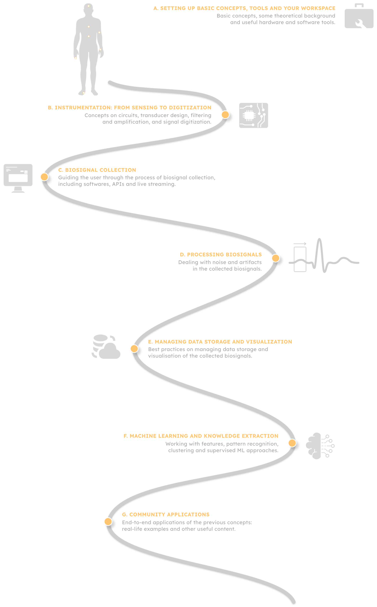

# <div  style="font-family:'arial blACK', sans-serif,monospace; text-align: left; min-height: 100px; vertical-align:bottom;" >  <span style="position:absolute; left: 0; bottom: 0; padding-right: 120px; padding-bottom: 10px"> <b> ScientISST Notebooks</b></span>  </div>

ScientISST Notebooks is a repository of educational content both teachers and learners, within the field of Biomedical Engineering - with a focus on biosignals and their applications in health.

The structure of the repository transpires the **duality** of our purpose: the contents are separated by knowledge area (for anyone that wishes to learn about a certain topic), as well as by academic courses (to be used and adapted by teachers for their courses). 

## Courses
The program of the courses that we currently support can be found in the following links:
- [IEB - Introduction to Biomedical Engineering](https://github.com/PIA-Group/ScientISST-notebooks/blob/master/_Courses/IST-UL-IEB-IntroductiontoBiomedicalEngineering.md) - ```Instituto Superior Técnico, Universidade de Lisboa```
- [TMED - Telemedicine](https://github.com/PIA-Group/ScientISST-notebooks/blob/master/_Courses/IPS-ESS-TMED-Telemedicine.md) - ```Escola Superior de Tecnologia de Setúbal, IPS```
- [IAS - Signal Acquisition Instrumentation in Bioengineering](./_Courses/IST-UL-IAS-SignalAcquisitionInstrumentationinBioengineering.MD) - ```Instituto Superior Técnico, Universidade de Lisboa```
- [MLB - Machine Learning in Bioengineering](https://github.com/PIA-Group/ScientISST-notebooks/blob/master/_Courses/IST-UL-MLB-MachineLearninginBioengineering.md) - ```Instituto Superior Técnico, Universidade de Lisboa```

## Knowledge Areas
The currently suported areas of knowledge are the following:

- [A. Setting up Basic Concepts, Tools and Your Workspace](./A.&#32Setting&#32up&#32Basic&#32Concepts,&#32Tools&#32and&#32Your&#32Workspace/)
- [B. Instrumentation: from Sensing to Digitization](./B.&#32Instrumentation:&#32from&#32Sensing&#32to&#32Digitization/)
- [C. Biosignal Collection](./C.&#32Biosignal&#32Collection/)
- [D. Processing Biosignals](./D.&#32Processing&#32Biosignals/)
- [E. Managing Data Storage and Visualization](./E.&#32Managing&#32Data&#32Storage&#32and&#32Visualization/)
- [F. Machine Learning and Knowledge Extraction](./F.&#32Machine&#32Learning&#32and&#32Knowledge&#32Extraction/)
- [G. Community Applications](./G.&#32Community&#32Applications:&#32Real-Life&#32Examples&#32and&#32Other&#32Useful&#32Content/)

Browse the latest release of the ScientISST Notebooks using Google Colab to open the Jupyter Notebooks directly:  
[](https://colab.research.google.com/github/scientisst/notebooks/blob/master/)

A **Master Index Table** is also available [here](https://markdownlivepreview.com/), where you can find the complete list of all the provided ScientISST Notebooks.

## The Journey of a Biosignal
Our approach is anchored on the _journey of a biosignal_: from its genesis by the recording of physiological parameter to its use on a real-world problem. The following infograph illustrates how the structure of this root repository emphasizes the different steps of that journey:



###### Some final notes
ScientISST Notebooks is managed and maintained by the ScientISST team at Instituto de Telecomunicações (IT), Lisboa, Portugal. For more of what we do at ScientISST, check out our website and follow us on Social.  

